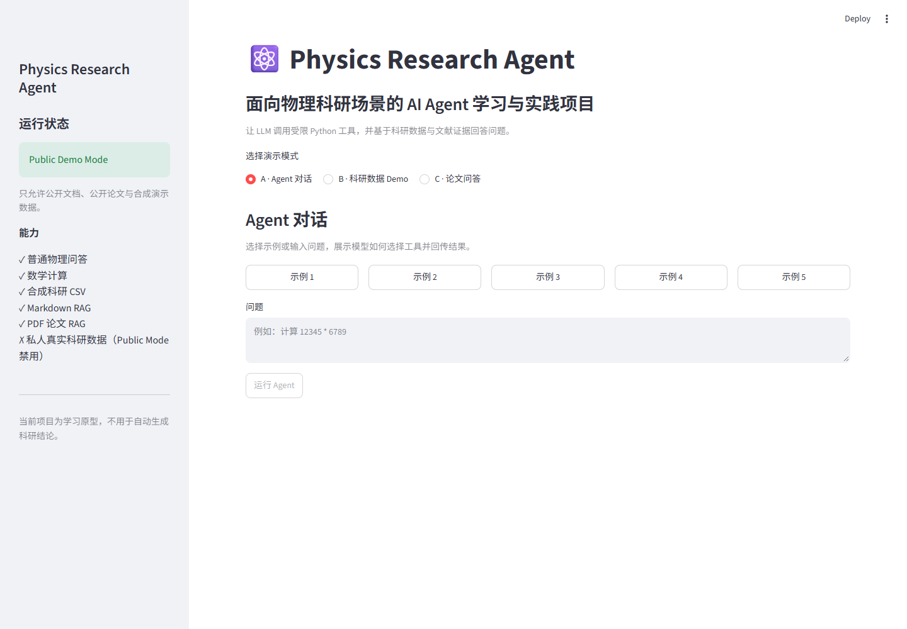
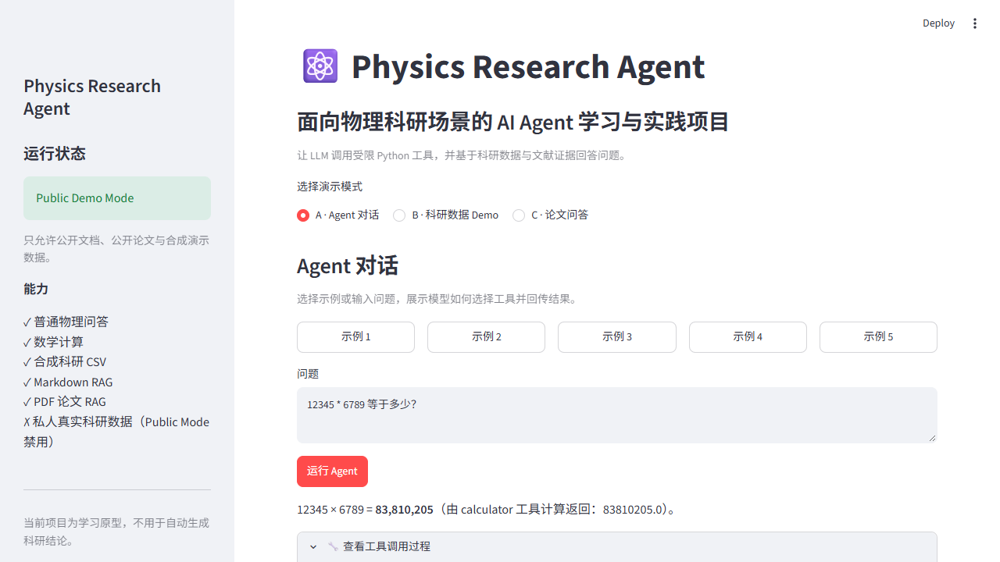
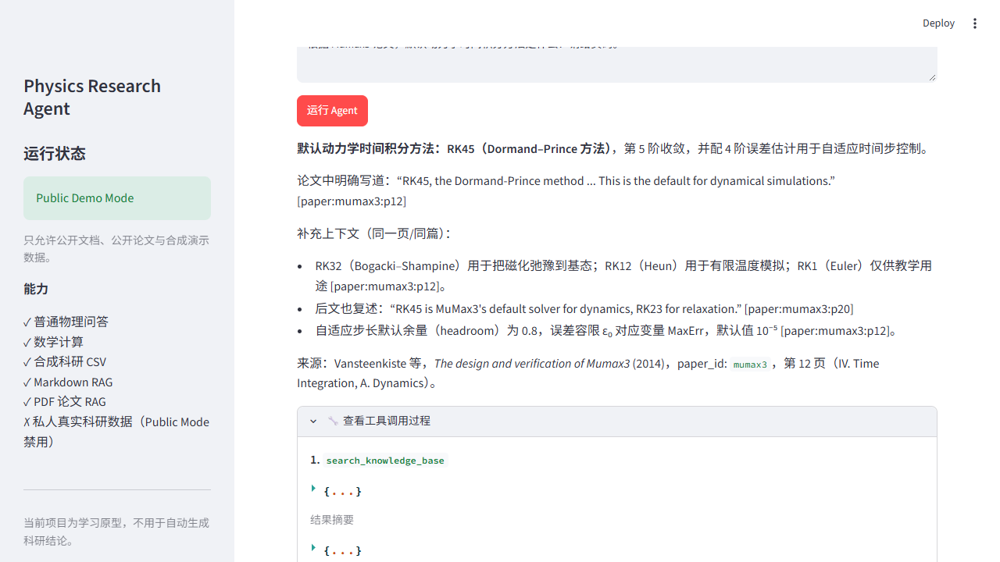
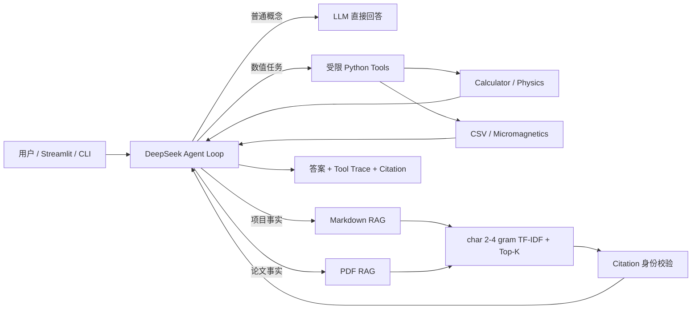

# Physics Research Agent

一个面向物理科研场景的可验证 AI Agent 原型：**LLM 负责工具选择，Python 执行数值分析，RAG 提供可追溯证据。**

它把三类容易混淆的事实来源分开处理：当前科研数据由 Python 重新计算，项目历史由 Markdown RAG 检索，论文结论由 PDF RAG 定位到真实页码。项目使用 DeepSeek Responses API，保持轻量、可读和可测试，不依赖 Agent 框架。

> 当前项目是学习与求职展示原型，不用于自动生成或替代科研结论。

## Demo

```powershell
conda run --no-capture-output -n agent streamlit run web_app.py
```

Web UI 包含三个模式：Agent 对话、合成科研数据 Demo、公开论文问答。默认开启 `PUBLIC DEMO MODE`，只允许公开项目文档、公开 Mumax3 论文与 `synthetic_micromagnetics.csv`。

| 首页 | Tool Calling | PDF RAG |
| --- | --- | --- |
|  |  |  |

## 核心能力

- DeepSeek Responses API、Tool Calling 与最多 5 轮的 Agent Loop
- AST 白名单数学计算与电子能量计算
- pandas 科研 CSV 检查、首次过零时间线性插值、matplotlib 绘图
- 本地 alias registry 适配授权的 MuMax3 / COMSOL 数据，不向模型暴露绝对路径
- Markdown/TXT 字符级 TF-IDF RAG，返回真实文件行号
- 文本型 PDF 逐页解析与 page-aware chunk，返回真实 PDF 页码
- 本轮 citation 身份校验、证据不足拒答、UNTRUSTED DATA 包装
- public/private 数据边界、路径穿越防护、敏感路径脱敏与 Git ignore
- 113 项 `unittest`，开发集、PDF 固定集和独立 holdout 分开报告

## 为什么做这个项目

物理科研问题经常混合三种来源：当前 CSV 的数值、项目文档中的历史记录、论文中的方法结论。如果让模型统一凭语言生成，容易把旧记录当成当前计算、把论文一般结论当成实验结果，或给出无法定位的引用。

本项目把“决策、执行、证据”拆开：模型决定是否调用工具；Python 负责确定性计算和访问控制；RAG 只提供允许目录中的证据。这样能看见每个结论来自哪里，也能明确哪些结论当前证据不足。

## 架构



## 真实案例与公开 Demo

授权的本地粗网格案例 `J=2.5e12 A/m²` 经当前原始曲线重新计算：MuMax3 首次负到正过零约 **73.838 ps**，COMSOL 约 **72.819 ps**，绝对差约 **1.019 ps**。这只说明两份曲线的过零时间不同，**不证明哪个软件更准确，也不足以给差异做机制归因**。

真实 CSV、registry 和图不会进入公开仓库。Web 截图与默认 Demo 只使用合成数据；合成曲线实际插值结果约为 73.799 ps 与 72.599 ps，明显标记 `SYNTHETIC`。

## RAG 与引用

Markdown 流程：允许目录 → 标题/行分块 → 字符级 TF-IDF → Top-K → `[source:Lstart-Lend]`。

PDF 流程：公开或授权 PDF → PyMuPDF 逐页提取 → 页内分块 → 同一检索器 → `[paper:mumax3:p12]`。

当前实现是透明的 baseline，不是 embedding、向量数据库或模型训练。引用校验只证明引用来自本轮检索集合；它不自动证明每一句话都由该片段蕴含，仍需人工核对。

## 安全边界

- `.env` 只在 Python 服务端读取；页面、URL、trace 和 Git 中都不显示 API Key。
- `PHYSICS_AGENT_PUBLIC_DEMO` 默认 `1`。只有用户明确设置为 `0`，本地运行才可接入 private registry。
- Public Mode 后端只暴露公开工具 schema，并再次校验工具名、数据集与文档范围；合成数据使用固定 `data/examples/...` 路径，不扫描 `data/local`。
- 外部真实数据由本地 registry 精确授权，模型只看到 alias；任意绝对路径、路径穿越和未注册名称会被拒绝。
- 文档与 PDF 都是 `UNTRUSTED DATA`，不会因为文本中的指令获得执行权限。
- `.env`、private registry、`data/local`、`outputs`、`knowledge/local` 和第三方论文 PDF 本体均被 Git 忽略。

这些措施适合单机学习原型，但不是多租户授权、完整脱敏或生产级防 prompt injection 系统。

## Evaluation

不同指标不合并成一个“准确率”：

| 评估 | 结果 | 含义 |
| --- | ---: | --- |
| unittest | 113/113 | 确定性代码与安全边界回归 |
| Day 5 dev project docs | 正例 8/8；负例 4/4 | 参与过开发调参，不是 holdout |
| Day 6 PDF fixed eval | Page Hit@4 6/6；负例拒绝 1/2 | 英文未知主题会误召回 |
| Day 6 all scope | project source Hit@4 7/8 | PDF 加入后发生排名退化 |
| Day 7 frozen holdout | Routing 4/4；Docs 2/4；PDF 4/4；Negative 1/4 | 独立题集，失败保留，不用于调参 |
| Day 7 generated answers | citation valid 7/8；grounding 5 Supported / 2 Partially / 1 Unsupported | citation identity 不等于 claim entailment |

Day 7 holdout SHA-256：`1b235726c32510aa2501760c141e293e7ba9a371c5a9867322837c7a42d6ea3a`。完整分析见 [Day7 Holdout Evaluation](docs/Day7_Holdout_Evaluation.md)。正式评估仅运行一次；没有为提高分数改阈值、硬编码关键词或重写题目。

## Quick Start

要求 Python 3.12.x。不要只相信 Conda 提示符，先确认解释器：

```powershell
python --version
where.exe python
conda create -n agent python=3.12 -y
conda run --no-capture-output -n agent python -m pip install -r requirements.txt
```

在项目根目录创建不提交的 `.env`：

```text
DEEPSEEK_API_KEY=your_key_here
PHYSICS_AGENT_PUBLIC_DEMO=1
```

公开论文 PDF 不随仓库再分发。按 [论文目录说明](knowledge/public/papers/README.md) 下载 `arXiv:1406.7635v3`，保存为 `knowledge/public/papers/mumax3_design_v3.pdf`。

```powershell
# CLI Agent
conda run --no-capture-output -n agent python run_agent.py

# 只做检索，不调用模型
conda run --no-capture-output -n agent python run_rag.py "Tool Calling 中谁执行 Python？"
conda run --no-capture-output -n agent python run_pdf_rag.py "RK45 Dormand-Prince default dynamics" --paper-id mumax3

# Web Demo
conda run --no-capture-output -n agent streamlit run web_app.py

# Tests
conda run --no-capture-output -n agent python -m unittest discover -s tests -v
```

没有 API Key 时，Web 会给出明确提示；合成数据模式和 PDF retrieval-only 降级仍可本地展示。

## 项目结构

```text
physics-research-agent/
├── web_app.py                  # Streamlit 公开 Demo
├── run_agent.py                # CLI Agent
├── run_rag.py / run_pdf_rag.py
├── src/
│   ├── agent.py                # Agent Loop、tool schema、trace
│   ├── tools/                  # 计算器、CSV、微磁学、registry
│   ├── rag/                    # 文档/PDF loader、chunk、retriever、citation
│   └── web/                    # Public Mode 与 trace 脱敏
├── data/examples/              # 可公开 synthetic CSV
├── knowledge/public/           # 公开元数据；PDF 本体忽略
├── scripts/evaluate_holdout.py
├── tests/                      # 单测、fixture、固定 eval/holdout
└── docs/                       # 学习、验收与求职材料
```

## Roadmap

已完成：受限 Tool Calling、科研 CSV、授权本地数据适配、Markdown/PDF RAG、引用身份校验、公开 Web Demo、独立 holdout 与作品集文档。

尚未完成：语义 embedding、OCR、长期记忆、claim entailment 自动评估、FastAPI/云部署、完善的访问控制和生产监控。下一步优先读懂现有核心代码并改进 evaluation，而不是继续堆框架。

## 说明

项目开发过程中大量使用 Codex 作为编码助手；需求拆解、物理数据背景和验收由用户持续参与。仓库能运行不等于用户已经可以从零手写全部代码，面试时应诚实说明，并通过亲自运行、阅读核心模块、修改 fixture 和解释失败案例来证明理解。
