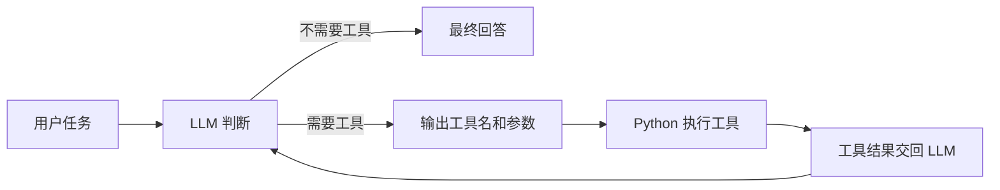

# Physics Research Agent

一个面向物理科研场景的 AI Agent 学习与实践项目。

## 项目目标

本项目从大模型 API 的基础调用开始，逐步构建能够读取科研资料、分析模拟数据、调用计算工具并生成科研报告的物理研究助手。代码优先保持简单、可读，便于理解 Agent 的底层工作方式。

## 当前能力

- DeepSeek 大模型调用
- CLI 交互
- `.env` 安全配置
- Tool Calling
- 安全数学计算工具
- 基础物理计算工具
- 简单 Agent Loop

## Day 1

完成 Python 环境搭建、Python 与 JSON 基础练习、DeepSeek API 调用，以及第一个终端交互式问答程序。`first_llm.py` 保留为 Day 1 的学习记录。

## Day 2

Day 2 为模型提供了 `calculator` 和 `electron_energy_from_voltage` 两个 Python 工具，并实现了最多 5 步的 Agent Loop。工具选择由 DeepSeek 根据问题和 tool schema 自主完成，Python 程序只负责分发、执行和回传结果，不使用问题关键词模拟工具选择。

普通 LLM 的流程：

```text
用户问题 → LLM → 回答
```

Agent 的流程：



当前使用 DeepSeek 的 Responses API。实际测试确认其能够返回 `function_call`；循环中会显式携带模型的工具调用输出和 Python 生成的 `function_call_output`，从而完成可靠的工具结果回传。

## 项目结构

```text
physics-research-agent/
├── .env                         # 本地密钥，不提交
├── .gitignore
├── README.md
├── requirements.txt
├── main.py                      # Day 1 Python 基础练习
├── first_llm.py                 # Day 1 LLM 调用
├── run_agent.py                 # Day 2 CLI 入口
├── docs/
│   └── Day2_Tool_Calling.md
├── src/
│   ├── __init__.py
│   ├── agent.py                 # Tool Calling 与 Agent Loop
│   └── tools/
│       ├── __init__.py
│       ├── calculator.py        # 安全数学计算
│       └── physics.py           # 电子能量计算
└── tests/
    ├── test_calculator.py
    └── test_physics.py
```

## 快速开始

```powershell
conda activate agent
pip install -r requirements.txt
```

在项目根目录创建 `.env`：

```dotenv
DEEPSEEK_API_KEY=your_key_here
```

启动 Agent：

```powershell
python run_agent.py
```

运行测试：

```powershell
python -m unittest discover -s tests -v
```

请勿提交 `.env`，也不要在代码、日志或截图中公开 API Key。

## 示例

问题：

```text
一个电子经过 5 V 电势差后获得多少能量？请同时给出 eV 和 J。
```

大致执行过程：

```text
[Agent] 调用工具：electron_energy_from_voltage
[Agent] 参数：{"voltage_v": 5}
[Tool] 结果：{"voltage_v": 5.0, "energy_ev": 5.0, "energy_j": 8.01088317e-19}
```

随后，DeepSeek 根据真实工具结果组织最终回答。

## 技术栈

- Python 3.12
- DeepSeek API
- OpenAI Python SDK
- python-dotenv
- Git / GitHub

## 学习路线

- [x] LLM API
- [x] CLI
- [x] Tool Calling
- [x] 简单 Agent Loop
- [ ] 多轮对话记忆
- [ ] CSV 科研数据分析
- [ ] 科研绘图
- [ ] PDF 阅读
- [ ] RAG
- [ ] 文献检索
- [ ] Web UI
