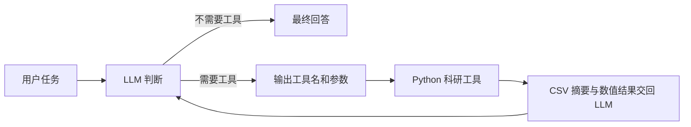

# Physics Research Agent

## 项目简介

一个面向物理科研场景的 AI Agent 学习与实践项目。

## 为什么做这个项目

普通 LLM 主要生成文本；科研任务还需要读取数据、可靠计算和生成图像。本项目让模型选择工具，由 Python 执行实际分析，再根据真实结果形成科研解释，逐步构建一个可以展示“物理 + AI Agent”实践能力的研究助手。代码优先保持简单、可读。

## 核心能力

- DeepSeek 大模型调用
- CLI 交互
- `.env` 安全配置
- Tool Calling
- 安全数学计算工具
- 基础物理计算工具
- 简单 Agent Loop
- 科研 CSV 结构与缺失值检查
- switching time 线性插值计算
- 多曲线科研绘图

## Day 1

完成 Python 环境搭建、Python 与 JSON 基础练习、DeepSeek API 调用，以及第一个终端交互式问答程序。`first_llm.py` 保留为 Day 1 的学习记录。

## Day 2

Day 2 为模型提供了 `calculator` 和 `electron_energy_from_voltage` 两个 Python 工具，并实现了最多 5 步的 Agent Loop。工具选择由 DeepSeek 根据问题和 tool schema 自主完成，Python 程序只负责分发、执行和回传结果，不使用问题关键词模拟工具选择。

普通 LLM 的流程：

```text
用户问题 → LLM → 回答
```

## 工作流程



当前使用 DeepSeek 的 Responses API。实际测试确认其能够返回 `function_call`；循环中会显式携带模型的工具调用输出和 Python 生成的 `function_call_output`，从而完成可靠的工具结果回传。

## 微磁学示例（Day 3）

平均磁化 `<mz>(t)` 描述磁化随时间的变化。这里将 switching time 定义为 `<mz>` 首次从负值达到或穿过零的时间。对满足 `m1 < 0`、`m2 >= 0` 的相邻点使用线性插值：

```text
t_switch = t1 + (0 - m1) * (t2 - t1) / (m2 - m1)
```

仓库示例数据为用于演示 Agent 工作流程的合成数据，并非真实科研实验/模拟原始数据。

`synthetic_micromagnetics.csv` 用 `tanh((t - t_switch) / 5)` 生成两条曲线，覆盖 0–100 ps，间隔 1 ps，共 101 个采样点。`mumax3_mz` 和 `comsol_mz` 只是演示列名，不代表实际运行过 MuMax3 或 COMSOL。

生成时设定的零点分别是 73.8 ps 和 72.6 ps；采样后线性插值会与这些设定值略有差异。这些时间与差异不用于评价真实模拟软件。

工具先检查列名，再按用户指定的时间列和磁化列分析，不依赖这两个示例列名。遇到 NaN、非数值、重复时间或无 crossing 时明确报错；未排序时间会排序并在结果中标记。起始值为零但没有此前负值时，不视为已确认的负到正 crossing。

数据与工具约定见 [合成数据说明](data/examples/README.md)，学习解释见 [Day 3 笔记](docs/Day3_Scientific_Data_Tools.md)。

六个真实 API Demo 与本地测试结果见 [Day 3 验收记录](docs/Day3_Verification.md)。

## 项目结构

```text
physics-research-agent/
├── .env                         # 本地密钥，不提交
├── .gitignore
├── README.md
├── requirements.txt
├── main.py                      # Day 1 Python 基础练习
├── first_llm.py                 # Day 1 LLM 调用
├── run_agent.py                 # Day 3 CLI 入口
├── data/
│   ├── examples/                # 可公开的 SYNTHETIC CSV 与说明
│   └── local/                   # 私有本地数据，仅提交 .gitkeep
├── outputs/                     # 运行输出，Git 忽略
│   └── plots/                   # 生成的 PNG
├── scripts/
│   └── generate_synthetic_data.py
├── docs/
│   ├── Day2_Tool_Calling.md
│   ├── Day3_Scientific_Data_Tools.md
│   └── Day3_Verification.md
├── src/
│   ├── __init__.py
│   ├── agent.py                 # Tool Calling 与 Agent Loop
│   └── tools/
│       ├── __init__.py
│       ├── calculator.py        # 安全数学计算
│       ├── physics.py           # 电子能量计算
│       └── scientific_data.py   # CSV 检查、插值与绘图
└── tests/
    ├── test_agent.py
    ├── test_calculator.py
    ├── test_physics.py
    └── test_scientific_data.py
```

## 快速开始

```powershell
conda activate agent
pip install -r requirements.txt
```

在项目根目录创建 `.env`：

```dotenv
DEEPSEEK_API_KEY=your_key_here
```

启动 Agent：

```powershell
python run_agent.py
```

运行测试：

```powershell
python -m unittest discover -s tests -v
```

请勿提交 `.env`，也不要在代码、日志或截图中公开 API Key。

可重复生成合成数据：

```powershell
python scripts/generate_synthetic_data.py
```

## 示例问题

- 有哪些科研数据集可以分析？
- 检查 synthetic_micromagnetics.csv，告诉我有哪些列、多少行。
- 比较 synthetic_micromagnetics.csv 中 MuMax3 和 COMSOL 的翻转时间。
- 把 mumax3_mz 和 comsol_mz 随 time_ps 的变化画在一张图里。
- 一个电子经过 5 V 电势差后获得多少能量？请给出 eV 和 J。

终端显示工具名、参数和简短结果。CSV 检查只返回前 5 行，不打印完整文件；绘图结果返回类似 `outputs/plots/synthetic_mz_comparison.png` 的路径。

## 安全设计

- `.env` 不提交，密钥由 python-dotenv 加载。
- `data/local/` 是私有数据目录，除 `.gitkeep` 外均被 Git 忽略；放入数据前需确认允许把摘要传给 DeepSeek API。Git 忽略不等于数据不会发送给模型。
- CSV 访问只限 `data/examples/`、`data/local/` 内直接存放的 CSV。工具用 `Path.resolve()` 验证最终路径，拒绝绝对路径、UNC 路径和路径穿越。
- 若两个目录有同名 CSV，使用 `examples/文件名.csv` 或 `local/文件名.csv` 明确选择。
- 输出名受白名单限制，PNG 只保存到 `outputs/plots/`，运行结果不自动提交。
- calculator 使用 AST 白名单，不执行任意 `eval()`。

## 技术栈

- Python 3.12
- DeepSeek API
- OpenAI Python SDK
- python-dotenv
- pandas / matplotlib
- Git / GitHub

## Roadmap（学习路线）

- [x] LLM API
- [x] CLI
- [x] Tool Calling
- [x] 简单 Agent Loop
- [x] 科研 CSV
- [x] switching time
- [x] 科研绘图
- [ ] 多轮上下文
- [ ] 真实 MuMax3 / COMSOL 数据适配
- [ ] PDF
- [ ] RAG
- [ ] 文献检索
- [ ] Web UI
