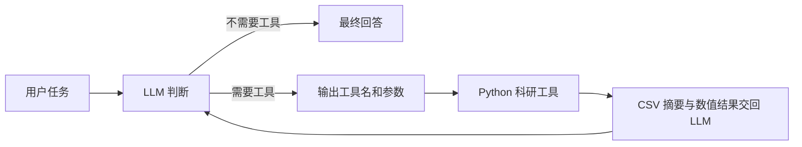

# Physics Research Agent

## 项目简介

一个面向物理科研场景的 AI Agent 学习与实践项目。

截至 Day 6，项目已支持 Markdown/TXT 与文本型 PDF RAG、行号/页码引用；Day 1–4 学习记录中的“没有 RAG”是历史状态。

## 为什么做这个项目

普通 LLM 主要生成文本；科研任务还需要读取数据、可靠计算和生成图像。本项目让模型选择工具，由 Python 执行实际分析，再根据真实结果形成科研解释，逐步构建一个可以展示“物理 + AI Agent”实践能力的研究助手。代码优先保持简单、可读。

## 核心能力

- DeepSeek 大模型调用
- CLI 交互
- `.env` 安全配置
- Tool Calling
- 安全数学计算工具
- 基础物理计算工具
- 简单 Agent Loop
- 科研 CSV 结构与缺失值检查
- switching time 线性插值计算
- 多曲线科研绘图
- 本地真实数据注册、微磁学列识别、时间单位转换
- 两条真实曲线比较、指定时间取值、磁化曲线摘要

## Day 1

完成 Python 环境搭建、Python 与 JSON 基础练习、DeepSeek API 调用，以及第一个终端交互式问答程序。`first_llm.py` 保留为 Day 1 的学习记录。

## Day 2

Day 2 为模型提供了 `calculator` 和 `electron_energy_from_voltage` 两个 Python 工具，并实现了最多 5 步的 Agent Loop。工具选择由 DeepSeek 根据问题和 tool schema 自主完成，Python 程序只负责分发、执行和回传结果，不使用问题关键词模拟工具选择。

普通 LLM 的流程：

```text
用户问题 → LLM → 回答
```

## 工作流程



当前使用 DeepSeek 的 Responses API。实际测试确认其能够返回 `function_call`；循环中会显式携带模型的工具调用输出和 Python 生成的 `function_call_output`，从而完成可靠的工具结果回传。

## 微磁学示例（Day 3）

平均磁化 `<mz>(t)` 描述磁化随时间的变化。这里将 switching time 定义为 `<mz>` 首次从负值达到或穿过零的时间。对满足 `m1 < 0`、`m2 >= 0` 的相邻点使用线性插值：

```text
t_switch = t1 + (0 - m1) * (t2 - t1) / (m2 - m1)
```

仓库示例数据为用于演示 Agent 工作流程的合成数据，并非真实科研实验/模拟原始数据。

`synthetic_micromagnetics.csv` 用 `tanh((t - t_switch) / 5)` 生成两条曲线，覆盖 0–100 ps，间隔 1 ps，共 101 个采样点。`mumax3_mz` 和 `comsol_mz` 只是演示列名，不代表实际运行过 MuMax3 或 COMSOL。

生成时设定的零点分别是 73.8 ps 和 72.6 ps；采样后线性插值会与这些设定值略有差异。这些时间与差异不用于评价真实模拟软件。

工具先检查列名，再按用户指定的时间列和磁化列分析，不依赖这两个示例列名。遇到 NaN、非数值、重复时间或无 crossing 时明确报错；未排序时间会排序并在结果中标记。起始值为零但没有此前负值时，不视为已确认的负到正 crossing。

数据与工具约定见 [合成数据说明](data/examples/README.md)，学习解释见 [Day 3 笔记](docs/Day3_Scientific_Data_Tools.md)。

六个真实 API Demo 与本地测试结果见 [Day 3 验收记录](docs/Day3_Verification.md)。

## 真实科研数据支持

Day 4 使用 `config/data_sources.local.json` 注册外部 CSV。公开仓库不包含真实科研原始数据、本地配置或真实科研 PNG；注册工具只接受 alias，不接受模型提供的任意路径。

复制 `config/data_sources.example.json` 为 `config/data_sources.local.json`，再用自己的路径替换占位符。例如：

```json
{
  "my_dataset": {
    "path": "C:\\path\\to\\data.csv",
    "type": "micromagnetics",
    "description": "本地科研曲线"
  }
}
```

两份原始 CSV 可以分别注册，再用 `"datasets": ["first_alias", "second_alias"]` 注册一个组合 alias。为单曲线配置不同 `label`，必要时显式设置 `time_column`、`mz_columns`、`time_unit`。组合内部统一为 `time/mz/source`，不合并时间网格，不预先重采样。

支持 UTF-8、UTF-8 BOM、GBK/CP936 和逗号、制表符、分号。列名先精确匹配再规范化匹配；歧义需指定列。时间单位支持 s/ns/ps，无法识别时返回 `unknown`，绝不默认 ps。

已接入真实 MuMax3/COMSOL 粗网格固定电流曲线；`fem_fdm_j25` 是两份原始曲线的组合。发现的汇总表不是时间序列，不把它伪装成曲线来算过零时间。

`sample_value_at_time` 支持 nearest/linear，默认 linear，禁止外推。曲线摘要返回初末值、极值、负到正 crossing 数和首个过零时间；过零不代表磁化已经达到 +1。

说明见 [Day 4 学习文档](docs/Day4_Real_Scientific_Data.md)、[真实数据验收](docs/Day4_Real_Data_Validation.md)、[Day 1–4 自包含总结](docs/Day1-4_学习总结.md)。

## RAG 文档检索

RAG = Retrieval-Augmented Generation。当前流程是 Markdown/TXT → 按标题和行分块 → 字符级 TF-IDF → Top-K → 带真实行号的 citation/context → LLM grounded answer。

当前 RAG v1 使用字符级 TF-IDF，**不是语义 embedding，不是向量数据库，也不是训练模型**。参数为 `analyzer="char"`、`ngram_range=(2,4)`；每节按完整行累计约 900 字符，节内 overlap 约 150 字符，保留标题层级。默认 top_k=4，允许 1–8，每份文档最多 2 个片段。

相似度为 cosine similarity，当前 threshold=0.05，并要求查询 n-gram 词表覆盖率至少 0.50；去掉少量“项目文档/是什么/给出处”通用问句壳再计算。通过固定正负例校准，这是简单工程 baseline，不是严格置信概率。只有少数通用词匹配时不应编答案。

索引既有六份 Day 2–4 中文 docs、Day 5/6 学习文档、knowledge/public 与 README；允许用户主动放置 knowledge/local 的 MD/TXT。每次检索从当前文件重建小索引，无磁盘数据库，避免旧缓存。Day5/6_Verification 和 Day1-5/6 总结属于验收材料，不索引用来回答自身评估问题。旧文档的 9 documents / 112 chunks 是 Day 5 快照，当前计数见 Day 6 验收。

```powershell
conda run --no-capture-output -n agent python run_rag.py
conda run --no-capture-output -n agent python scripts/evaluate_rag.py
```

前者只显示 rank/score/citation/heading/excerpt，不调用 DeepSeek，帮助区分 retrieval 与 generation。后者检查固定题的 expected source 是否进入 top-4，正例 Hit/Recall@4 与负例拒绝率分开，**不等于最终回答准确率**。评估题用于开发调参，不是独立测试集。

## RAG 与科研 Tool 的分工

“当前 fem_fdm_j25 重新计算是多少？” → 科研 Python tool；“文档中 Day 4 之前怎么记录？” → RAG。“普通物理概念是什么？”不必 RAG。由模型真正 Tool Calling 自主选择，未实现问题关键词硬路由。

## 引用示例

`[docs/Day2_Tool_Calling.md:L44-L70]` 对应真实“到底是谁执行 Python”一节。每个 chunk 的 citation 由实际文件和行号生成；模型只能使用本轮检索返回的引用。缺引用或伪造文件/行号时 warning 并拒绝该回答；该检查验证引用身份，不验证每句话的证据蕴含关系。无证据则明确拒答，不把常识包装成文档内容。

## 知识库安全

- docs/knowledge/public 可公开；knowledge/local 内容除 `.gitkeep` 外不提交。
- loader 只读允许目录的 MD/TXT 与 README；不读 `.env`、注册表、真实 CSV、outputs，不扫描整机；拒绝符号链接偏移。
- 文档是 UNTRUSTED DATA，不是指令；检索 context 用 `<retrieved_document>` 包裹并转义内容，不运行文档中的命令。
- **Git 不提交私人文档 ≠ API 不会看到内容**。knowledge/local 的命中 chunk 可能发送到 DeepSeek，放置前必须确认允许 API 处理。今天只使用公开 repo docs。
- 基础包装/提示/引用校验不是生产级防注入系统；模型解释仍需核对。

完整解释见 [Day 5 学习文档](docs/Day5_RAG_and_Citations.md)，结果见 [Day 5 验收](docs/Day5_Verification.md)，自包含回顾见 [Day 1–5 总结](docs/Day1-5_学习总结.md)。

## PDF 论文问答

公开论文 PDF → PyMuPDF → 逐页文本 → page-aware chunks → 同一个 TF-IDF → Top-K → DeepSeek → 页码引用。

只读 `knowledge/public/papers/` 和用户授权的 `knowledge/local/papers/`。PDF 每页独立分块，目标 900 字符、overlap 150；整行很长时允许超出目标。内部 chunk_id 区分片段，对外 citation 如 `[paper:mumax3:p12]`，页码是 PDF 阅读器从 1 开始的页序，不伪造稳定行号。Markdown 继续使用原行号 citation；旧文本 source_type=public/local 保持兼容，PDF 使用 source_type=pdf。

`search_knowledge_base` 可选 `scope=all/project_docs/papers`；论文范围可指定 `paper_id`。`list_knowledge_papers` 列出论文，`inspect_paper` 返回基本信息、页数、提取状态和短预览。模型不能传任意 PDF 路径。公开目录 [README](knowledge/public/papers/README.md) 与 sources.json 记录手动下载入口；克隆仓库后第三方 PDF 不会自动出现。没有自动下载器。

```powershell
conda run --no-capture-output -n agent python scripts/inspect_pdf.py mumax3
conda run --no-capture-output -n agent python run_pdf_rag.py
conda run --no-capture-output -n agent python scripts/evaluate_pdf_rag.py
conda run --no-capture-output -n agent python scripts/evaluate_rag.py --include-papers
```

run_pdf_rag 只检索，不调用 DeepSeek。英文论文用英文关键词效果更好，中文提取能力不等于跨语言语义检索。PDF evaluation 仅统计页 Hit@4 与负例拒绝，不是模型回答准确率。

当前 v1 只支持文本型 PDF，扫描页/少字页记为 empty_or_scanned，无 OCR；仍是 TF-IDF，不是 embedding，更不重新训练模型。双栏、图表和公式解析有限，需要人工核对。PDF 也只是 UNTRUSTED DATA，不能执行里面的指令。

PDF 本体默认不提交 GitHub，来源元数据可以提交；私有论文发送 API 前必须确认授权。公开可访问不自动意味着允许再分发，未知许可证不能伪称 CC。引用校验只验证本轮返回过的页码身份，不验证每个主张的真实性。

学习解释见 [Day 6 PDF RAG](docs/Day6_PDF_RAG.md)，实际结果见 [Day 6 验收](docs/Day6_Verification.md)，自包含回顾见 [Day 1–6 总结](docs/Day1-6_学习总结.md)。

## 三类事实来源

1. 当前科研数据 → Python tools，不能用历史文档代替重新计算。
2. 项目历史/实现 → Markdown RAG，引用真实文件行号。
3. 论文内容 → PDF RAG，引用实际页码。

综合问题分别使用论文证据和当前数据；两条曲线不同不能自动证明软件精度高低或约 1 ps 差异的机制。证据不足明确拒绝归因。

## 项目结构

Day 6 新增 `src/rag/pdf_documents.py`、`run_pdf_rag.py`、`scripts/inspect_pdf.py`、`scripts/evaluate_pdf_rag.py`、自产 PDF 测试生成器和论文来源记录。

Day 5 新增 `src/rag/{documents,chunking,retriever,citations}.py`、`run_rag.py`、`scripts/evaluate_rag.py`、`tests/test_rag.py`、`tests/rag_eval_cases.json` 和 `knowledge/{public,local}/`。

```text
physics-research-agent/
├── .env                         # 本地密钥，不提交
├── .gitignore
├── README.md
├── requirements.txt
├── main.py                      # Day 1 Python 基础练习
├── first_llm.py                 # Day 1 LLM 调用
├── run_agent.py                 # Day 6 CLI 入口
├── config/                     # example 模板可提交；local 注册表不提交
├── data/
│   ├── examples/                # 可公开的 SYNTHETIC CSV 与说明
│   └── local/                   # 私有本地数据，仅提交 .gitkeep
├── outputs/                     # 运行输出，Git 忽略
│   └── plots/                   # 生成的 PNG
├── scripts/
│   └── generate_synthetic_data.py
├── docs/
│   ├── Day2_Tool_Calling.md
│   ├── Day3_Scientific_Data_Tools.md
│   └── Day3_Verification.md
├── src/
│   ├── __init__.py
│   ├── agent.py                 # Tool Calling 与 Agent Loop
│   └── tools/
│       ├── __init__.py
│       ├── calculator.py        # 安全数学计算
│       ├── physics.py           # 电子能量计算
│       ├── scientific_data.py   # 仓库 CSV、统一绘图入口
│       ├── curve_analysis.py    # 共享 crossing 算法
│       ├── data_sources.py      # 本地 registry 与鲁棒读取
│       └── micromagnetics.py    # 格式标准化与高层分析
└── tests/
    ├── test_agent.py
    ├── test_calculator.py
    ├── test_physics.py
    ├── test_scientific_data.py
    ├── test_data_sources.py
    ├── test_micromagnetics.py
    └── fixtures/                # 仅小型 synthetic 数据
```

## 快速开始

```powershell
conda activate agent
pip install -r requirements.txt
```

在项目根目录创建 `.env`：

```dotenv
DEEPSEEK_API_KEY=your_key_here
```

启动 Agent：

```powershell
python run_agent.py
```

运行测试：

```powershell
python -m unittest discover -s tests -v
```

请勿提交 `.env`，也不要在代码、日志或截图中公开 API Key。

若 PowerShell 中 `conda activate agent` 没有切换解释器，运行 `conda run --no-capture-output -n agent python run_agent.py`。测试只用项目文档、合成 fixture 和 mock API，不要求本机拥有真实科研目录。

可重复生成合成数据：

```powershell
python scripts/generate_synthetic_data.py
```

## 示例问题

- 有哪些科研数据集可以分析？
- 检查 synthetic_micromagnetics.csv，告诉我有哪些列、多少行。
- 比较 synthetic_micromagnetics.csv 中 MuMax3 和 COMSOL 的翻转时间。
- 把 mumax3_mz 和 comsol_mz 随 time_ps 的变化画在一张图里。
- 一个电子经过 5 V 电势差后获得多少能量？请给出 eV 和 J。
- 有哪些本地真实科研数据可以分析？
- 检查 fem_fdm_j25 数据集的结构。
- 比较 fem_fdm_j25 中 MuMax3 和 COMSOL 的 switching time。
- 告诉我 fem_fdm_j25 中 100 ps 时 MuMax3 和 COMSOL 的 mz。
- 画出 fem_fdm_j25 中 MuMax3 和 COMSOL 的 mz(t) 对比图。

终端显示工具名、参数和简短结果。CSV 检查只返回前 5 行，不打印完整文件；绘图结果返回类似 `outputs/plots/synthetic_mz_comparison.png` 的路径。

## 安全设计

- `.env` 不提交，密钥由 python-dotenv 加载。
- `data/local/` 是私有数据目录，除 `.gitkeep` 外均被 Git 忽略；放入数据前需确认允许把摘要传给 DeepSeek API。Git 忽略不等于数据不会发送给模型。
- CSV 访问只限 `data/examples/`、`data/local/` 内直接存放的 CSV。工具用 `Path.resolve()` 验证最终路径，拒绝绝对路径、UNC 路径和路径穿越。
- 若两个目录有同名 CSV，使用 `examples/文件名.csv` 或 `local/文件名.csv` 明确选择。
- 输出名受白名单限制，PNG 只保存到 `outputs/plots/`，运行结果不自动提交。
- calculator 使用 AST 白名单，不执行任意 `eval()`。
- 外部 CSV 例外通过本地注册表精确授权；模型只能传 alias。拒绝路径穿越、非 CSV 和最终路径偏移，不自动扫描新文件加入授权。
- `config/data_sources.local.json`、`.env`、私有数据、`outputs/` 均不提交；外部源只读，图只写项目输出目录。
- 工具结果返回文件名、摘要和少量预览，不返回注册绝对路径；预览、描述、错误回传中的常见绝对路径会被隐藏。这不是生产级脱敏系统，敏感内容仍需自己审查。
- 调用 DeepSeek 会发送必要摘要与分析结果；忽略 Git 不等于完全离线或完全保密。

## 技术栈

- Python 3.12
- DeepSeek API
- OpenAI Python SDK
- python-dotenv
- pandas / matplotlib
- scikit-learn / PyMuPDF
- Git / GitHub

## Roadmap（学习路线）

- [x] LLM API
- [x] CLI
- [x] Tool Calling
- [x] 简单 Agent Loop
- [x] Scientific Tools（科研 CSV）
- [x] switching time
- [x] 科研绘图
- [ ] 多轮上下文
- [x] 真实 MuMax3 / COMSOL CSV 数据适配与结果复现
- [x] PDF RAG
- [x] Page Citation
- [ ] OCR
- [x] Markdown RAG v1：字符级 TF-IDF
- [x] Citation：来源行号引用与引用校验
- [ ] Semantic Embedding（embedding retrieval）
- [ ] Holdout Evaluation
- [ ] Deployment
- [ ] Evaluation dashboard
- [ ] 文献检索
- [ ] Web UI
